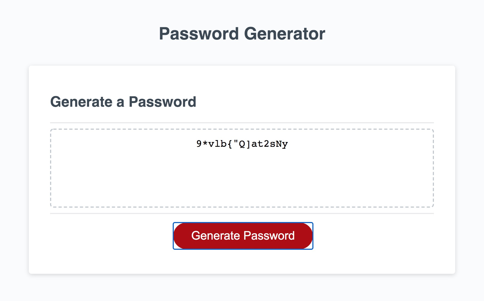

# Password Generator
​
## Description 
​​
I was given the assignment of creating a password generator that would let a user pick the length of the password and whether or not they would want certain characters. The challenge provided the html and css, while I had to show of what I've learned from my lessons about JavaScript.

First, I structured the directories to fit best practices and rewrote the html just a little bit to accomodate this organization. 

In order to accomplish the requirments of the challenge, I had to head to the JavaScript source page and write several prompts and alerts that would fulfill the acceptance criteria. Second, I had to write a for loop incorporating the JavaScript Math object that would write a random password from the arrays that I created using the user's preferences, and store the result in an array. Finally I had to join that array as a string and name it so it would appear in the box for the User. Voila! You've got yourself a password! 
​
You can find my password generator at https://clayto30.github.io/friendly-parakeet/
​​​
## Installation
​
My password Generator is deployed from my GitHub Repo https://github.com/Clayto30/friendly-parakeet

Feel free to head to my website and check it out! Simply answer the prompts, and you will get a password of your desired styling.
​
​
## Usage 
​
When you visit my page, click on the button that says "Generate Password" to get started.
You will be asked how many characters long you would like it to be. Feel free to choose a password that is shorter or longer, and you will see I keep you on course! Now, choose on within the limits to proceed!

Please click "OK" when appropriate to select upper case characters, lower case characters, special characters, and/or numerals. Your password will be made up of a random assortment of whichever groups you choose.
​

​
​
## Credits
​
Wesley Tran is my TA at the UCBExt Coding Bootcamp, and he and the rest of the instructional staff provided exceptional guidance along the way! Wesley in particular was a great help and you can find his GitHub profile at https://github.com/WebDevWes
​
The UCBExtension Coding Bootcamp designed this challenge, provided the starter code, and is the source of my instruction. This instruction is of course, essential to what I've done here. 
​
​
## License
​
Copyright (c) 2021 Clayton Goff

Permission is hereby granted, free of charge, to any person obtaining a copy
of this software and associated documentation files (the "Software"), to deal
in the Software without restriction, including without limitation the rights
to use, copy, modify, merge, publish, distribute, sublicense, and/or sell
copies of the Software, and to permit persons to whom the Software is
furnished to do so, subject to the following conditions:

The above copyright notice and this permission notice shall be included in all
copies or substantial portions of the Software.

THE SOFTWARE IS PROVIDED "AS IS", WITHOUT WARRANTY OF ANY KIND, EXPRESS OR
IMPLIED, INCLUDING BUT NOT LIMITED TO THE WARRANTIES OF MERCHANTABILITY,
FITNESS FOR A PARTICULAR PURPOSE AND NONINFRINGEMENT. IN NO EVENT SHALL THE
AUTHORS OR COPYRIGHT HOLDERS BE LIABLE FOR ANY CLAIM, DAMAGES OR OTHER
LIABILITY, WHETHER IN AN ACTION OF CONTRACT, TORT OR OTHERWISE, ARISING FROM,
OUT OF OR IN CONNECTION WITH THE SOFTWARE OR THE USE OR OTHER DEALINGS IN THE
SOFTWARE.
